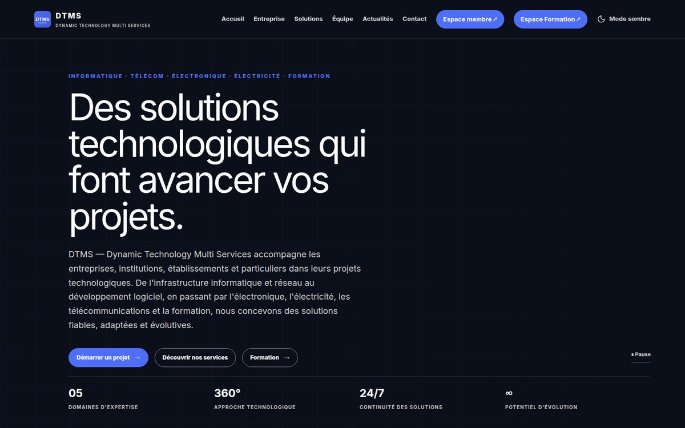

<h1 align="center">Guelord Mwenderwa</h1>

  <strong>Embedded Systems and AI Engineer</strong> 
  Electronics · Firmware · Machine Learning · Backend Platforms 
  Goma, DR Congo

  
  
  

---

## About

I build systems end to end, from the sensor to the decision. That covers the circuit and the firmware on the device, the signal processing and machine learning that interpret its data, and the backend and web platform people use to operate it.

My training combines both sides. I studied general electronics at a technical institute, and I am now completing a Licence in Computer Science specialised in Artificial Intelligence. My work sits where the two meet: access control, energy monitoring, building automation, predictive maintenance and business platforms.

I publish my work as tested, documented open source, and I teach embedded programming and full-stack web development.

**Currently**
- Completing the second year of the AI Licence at ISIG Goma
- Building business platforms in TypeScript (React, Express, Prisma, PostgreSQL)
- Bringing machine learning onto microcontrollers for predictive maintenance

---

## Featured work

<table>
<tr>
<td width="50%" valign="top">

### [Edge AI Motor Fault Detector](https://github.com/GUELORD-MWENDERWA/edge-ai-motor-fault-detector)
Diagnoses overload, bearing faults and imbalance from a motor's current signature with a 172-parameter neural network **running on an ESP32**. Covers the full pipeline: signal modelling, feature engineering, training in Python, export to C++, and a parity test proving that the firmware computes what the model learned.

`ESP32` `TinyML` `NumPy` `C++` `Signal processing`

</td>
<td width="50%" valign="top">

### [Computer Lab Automation System](https://github.com/GUELORD-MWENDERWA/SYSTEME_DOMOTIQUE-_SALLE-_NFORMATIQUE)
Building controller with dual-reader RFID access, occupancy counting, PZEM-004T energy metering, daylight-aware lighting and night-time intrusion detection. Operated from a web dashboard, a REST API and a serial console. The firmware is split into eleven modules.

`ESP32` `C++17` `RFID` `REST API` `IoT`

</td>
</tr>
<tr>
<td width="50%" valign="top">

### [Circuit Solver](https://github.com/GUELORD-MWENDERWA/circuit-solver)
SPICE-like simulator based on modified nodal analysis: DC operating point, AC frequency sweep and backward-Euler transient. It reads standard netlists and is validated against closed-form results (Thevenin, -3 dB point, RLC resonance, RC charge).

`Python` `NumPy` `Circuit theory` `Numerical methods`

</td>
<td width="50%" valign="top">

### [SGIS: School Management API](https://github.com/GUELORD-MWENDERWA/sgis-v2)
REST API for school administration: roles, classes, students and attendance recorded by QR code, by ESP32 RFID terminals authenticated with module tokens, or manually. Deployable on Render with PostgreSQL.

`Django REST Framework` `JWT` `PostgreSQL` `RFID`

</td>
</tr>
<tr>
<td width="50%" valign="top">

### [ESP32 Web Oscilloscope](https://github.com/GUELORD-MWENDERWA/esp32-web-oscilloscope)
Browser-based oscilloscope sampling up to 50 kS/s, with an edge trigger that has hysteresis and pre-trigger history, plus automatic Vpp, Vrms, frequency and duty-cycle measurements. It needs no external libraries and can run as its own access point.

`ESP32` `ADC` `Web UI` `Instrumentation`

</td>
<td width="50%" valign="top">

### [Machine Learning from Scratch](https://github.com/GUELORD-MWENDERWA/ml-from-scratch)
Linear models, CART trees, k-NN, k-means, PCA and a multilayer perceptron with hand-written backpropagation, verified by numerical gradient checking. Uses NumPy only, with a scikit-learn-style API.

`Python` `NumPy` `Neural networks` `Optimisation`

</td>
</tr>
</table>

---

## Live platforms

Production web platforms I design and maintain for organisations in the region. The source code is private; the sites are public.

<table>
<tr>
<td width="50%" valign="top">

### [Afronova](https://afronova-web.vercel.app/)
Bilingual corporate website with a member area, backed by an internal business application and a client portal.

`React` `TypeScript` `Express` `Prisma` `PostgreSQL`

</td>
<td width="50%" valign="top">

### [DTMS: Dynamic Technology Multi Services](https://dtms.site/)
Public website, member area and training portal for a company working in IT, telecommunications, electronics and electrical installations. It runs on modules for staff, projects, clients, operations and finance.

`Firebase` `Firestore` `JavaScript` `React` `Node.js`

</td>
</tr>
</table>

**[ESP32 sensor dashboard](https://domotiqueesp32-6d6d2.web.app/)**: authenticated web app that displays live readings sent by an ESP32 to the Firebase Realtime Database.

These platforms are TypeScript or JavaScript codebases with role-based access control, client portals, cash and contribution management, PDF reporting and real-time updates. They are maintained with linting, strict typing, automated tests and CI.

---

## Open source libraries and tools

Each project implements its subject from first principles, ships with a test suite and continuous integration, and documents what has and has not been validated. Python libraries install with `pip install git+https://github.com/GUELORD-MWENDERWA/<repo>.git`, and each release provides ready-to-use files: Python wheels, firmware images to flash, or the SQL scripts.

### Artificial intelligence, mathematics and data

| Project | Description | CI |
| --- | --- | --- |
| [edge-ai-motor-fault-detector](https://github.com/GUELORD-MWENDERWA/edge-ai-motor-fault-detector) | Neural network fault diagnosis on a microcontroller, from Python training to C++ inference |  |
| [ml-from-scratch](https://github.com/GUELORD-MWENDERWA/ml-from-scratch) | Core ML algorithms and an MLP with manual backpropagation |  |
| [statistics-from-scratch](https://github.com/GUELORD-MWENDERWA/statistics-from-scratch) | Distributions, hypothesis tests and regression inference in pure Python, validated against SciPy |  |
| [numerical-analysis-toolkit](https://github.com/GUELORD-MWENDERWA/numerical-analysis-toolkit) | Root finding, interpolation, quadrature, Runge-Kutta, direct and iterative linear solvers |  |
| [PROJET-TUTORE-LSI-IA-L1](https://github.com/GUELORD-MWENDERWA/PROJET-TUTORE-LSI-IA-L1) | Shape recognition with contour features, Hu moments and a Random Forest | |

### Electronics and embedded systems

| Project | Description | CI |
| --- | --- | --- |
| [circuit-solver](https://github.com/GUELORD-MWENDERWA/circuit-solver) | Modified nodal analysis simulator: DC, AC and transient |  |
| [esp32-web-oscilloscope](https://github.com/GUELORD-MWENDERWA/esp32-web-oscilloscope) | Triggered oscilloscope with a browser display |  |
| [dc-motor-pid-controller](https://github.com/GUELORD-MWENDERWA/dc-motor-pid-controller) | Motor speed control with a PID unit-tested against a motor model |  |
| [arduino-component-tester](https://github.com/GUELORD-MWENDERWA/arduino-component-tester) | Auto-ranging resistance, capacitance from RC timing, diode identification |  |
| [electronics-toolkit](https://github.com/GUELORD-MWENDERWA/electronics-toolkit) | Design calculator: colour codes, E-series, NE555, op-amps, regulators, rectifiers |  |
| [logic-circuit-toolkit](https://github.com/GUELORD-MWENDERWA/logic-circuit-toolkit) | Boolean parsing, Quine-McCluskey minimisation, gate-level simulation |  |

### Systems, networks and databases

| Project | Description | CI |
| --- | --- | --- |
| [os-scheduling-simulator](https://github.com/GUELORD-MWENDERWA/os-scheduling-simulator) | CPU scheduling, page replacement, Banker's algorithm, disk scheduling |  |
| [ipv4-network-toolkit](https://github.com/GUELORD-MWENDERWA/ipv4-network-toolkit) | Subnetting, VLSM, route summarisation, link-state routing |  |
| [academic-records-database](https://github.com/GUELORD-MWENDERWA/academic-records-database) | 3NF academic records schema, tested on SQLite and PostgreSQL |  |

---

## Connected systems and firmware

| Project | Description |
| --- | --- |
| [smart-door-rfid_arduino](https://github.com/GUELORD-MWENDERWA/smart-door-rfid_arduino) | RFID and keypad door controller built on an explicit state machine, with an EEPROM badge store and a Python desktop companion |
| [rfid_attendance](https://github.com/GUELORD-MWENDERWA/rfid_attendance) | Dual-reader RFID attendance terminal that reports over Wi-Fi from an ESP8266 |
| [433 MHz transmitter](https://github.com/GUELORD-MWENDERWA/emeteur_433mhz_rf-interrupteur_4_pos_arduino_code) · [receiver](https://github.com/GUELORD-MWENDERWA/recepteur_433mhz_rf-interrupteur_4_pos_arduino_code) | Four-channel RF remote with sequence numbers, burst retransmission and timed relay modes |
| [esp32-web-control](https://github.com/GUELORD-MWENDERWA/esp32-web-control) | Mobile-first control pad for ESP32 devices on the local network |
| [utilisation_millis_arduino_](https://github.com/GUELORD-MWENDERWA/utilisation_millis_arduino_) | Non-blocking LCD status display, a reference example of `millis()` timing |

---

## Teaching

| Course | Content |
| --- | --- |
| [FORMATION-PROGRAMMATION-EMBARQUER](https://github.com/GUELORD-MWENDERWA/FORMATION-PROGRAMMATION-EMBARQUER) | Embedded C++ fundamentals on Arduino, one concept per exercise |
| [FORMATION-PYTHON-DJANGO](https://github.com/GUELORD-MWENDERWA/FORMATION-PYTHON-DJANGO) | Full-stack path from HTML and CSS to a Django application deployed to production |

---

## Education

| Institution | Program |
| --- | --- |
| **ISIG Goma**, Institut Supérieur d'Informatique et de Gestion | Licence in Computer Science, Artificial Intelligence track (LSI-IA), second year |
| **ITIG Don Bosco**, Institut Technique Industriel de Goma | Technical diploma in General Electronics |

---

## Technical skills

| Area | Technologies |
| --- | --- |
| Embedded | C, C++, Arduino (AVR), ESP32, ESP8266, STM32, PlatformIO, UART, SPI, I2C, ADC sampling, OTA |
| Electronics | Analog and digital design, power supplies, sensors and measurement, RFID, 433 MHz RF, circuit simulation |
| Control | Discrete PID, anti-windup, encoder feedback, motor drives |
| AI and data | Python, NumPy, pandas, scikit-learn, OpenCV, TensorFlow, neural networks, feature engineering, embedded inference |
| Mathematics | Numerical analysis, statistics and hypothesis testing, linear algebra |
| Backend | Django, Django REST Framework, Node.js, Express, Prisma, REST, JWT |
| Front end | React, TypeScript, Vite, Tailwind CSS, HTML, CSS, JavaScript |
| Data and infrastructure | PostgreSQL, SQLite, Firebase, relational modelling, Git, GitHub Actions, Linux, Render |

  
  
  
  
  
  
  
  
  
  
  
  
  
  
  

---

## Engineering principles

- **Verify against a reference.** Numerical code is checked against analytical results or established libraries, and firmware logic is unit-tested on the host before it reaches hardware.
- **Make the model and the device agree.** When an algorithm is trained or designed on a computer and deployed on a microcontroller, a test proves that both compute the same thing.
- **Design hardware and software together.** Pin maps, protocols and data models are specified before code is written.
- **State limits honestly.** Every project says what has been validated and what has not.

---

  
  

